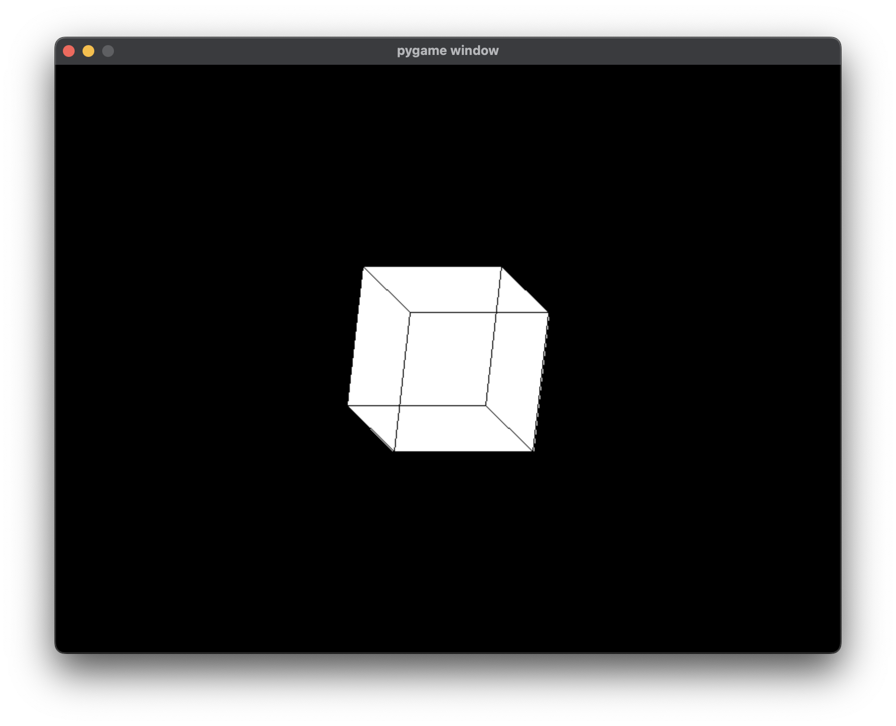

# PyRenderLab
A very simple, 3D framework made in PyGame. Just a personal project of mine.

---

## Setup
- Installing libraries:
`pip3 install -r requirements.txt`
- Run the setup file:
`python3 setup.py install`

## Important notes
- The `img_path` attribute of the Texture class is functional but still in its infancy. This is due to its recent development.
- This project is not made for commercial use. This is just a personal project of my mine.
- All the 3D shapes in the library, are just classes inherited from the `Shape3D` abstract class. So feel free to add your own 3D shapes and contribute!

## Use
Here is a sample script utilizing this framework
```python
import pyrenderlab

VELOCITY = 5


def update():
    keys = game.keys
    if keys[pyrenderlab.K_w]:
        new_shape.y -= VELOCITY
    if keys[pyrenderlab.K_s]:
        new_shape.y += VELOCITY
    if keys[pyrenderlab.K_a]:
        new_shape.x -= VELOCITY
    if keys[pyrenderlab.K_d]:
        new_shape.x += VELOCITY
    if keys[pyrenderlab.K_q]:
        game.stop()
    diff_x = (game.mousex - centerx) / 500
    diff_y = (game.mousey - centery) / 500
    new_shape.angle_y = diff_x
    new_shape.angle_x = diff_y


game = pyrenderlab.Game(bg_color=(0, 0, 0), update=update)
centerx, centery = game.width / 2, game.height / 2

new_shape = pyrenderlab.Cube(game, 150)

all_shapes = [new_shape]
game.add_objects(all_shapes)

game.display(60)
```
And this is what the window would look like:
### Window:


### Window Icon:


### Functionality:
- Spin in the x, y and z axes with the mouse movement
- Move with *w*, *a*, *s* and *d*

## License
This project is licensed under the MIT license. Learn more [here](LICENSE)